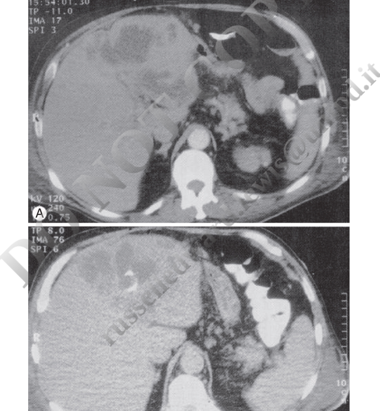

# PART I: APPENDICITIS {#part-appendicitis}

## Introduction {#intro-appendicitis}

In 1886, Fitz first described the natural course of acute inflammation of the appendix, coining the term *appendicitis* and advocating early surgical intervention [@Fitz1886]. With an incidence of 108 cases per 100,000 person-years in the United States and 100 to 150 cases per 100,000 person-years in most upper-middle-income countries, appendicitis is among the most common surgical emergencies of the abdomen [@Addiss1990]. Improvements in clinical assessment, antibiotic therapy, and surgical management have reduced the overall mortality rate of acute appendicitis to less than 1%, although rates increase to 5% or more in the elderly [@Korner1997; @Berry1984; @Blomqvist2001].

## Epidemiology {#epi-appendicitis}

The lifetime risk for acute appendicitis is 8.6% in men and 6.7% in women in industrialized countries [@Korner1997]. In 2018, a total of 190,000 appendectomies were performed in the United States, constituting 1.3% of all operating room procedures [@Bhangu2015]; however, this represents a 42% decrease since 2011, likely because of the increasing adoption of nonoperative medical management of uncomplicated appendicitis [@Flum2021].

::: {.callout-note}
## Key Epidemiologic Point
Although the frequency of appendectomy surgery is declining, it is still ranked as the most common surgery for individuals aged 17 years and younger in the United States.
:::

Appendicitis is rare in infants, but its incidence steadily increases through childhood and reaches a peak at 15 to 25 years of age for men and women [@Korner1997; @Berry1984; @Blomqvist2001; @Livingston2007]. The incidence declines through adulthood, and less than 25% of cases occur in individuals older than 45 years. Men have slightly higher rates than women; the overall male-to-female rate ratio is 1.4:1 [@Korner1997].

Similar to diverticulitis, the incidence of appendicitis is significantly lower in rural, nonindustrialized areas [@Burkitt1971; @Walker1973]. Also like diverticulitis, appendicitis rates increase as societies become industrialized [@Barker1988; @Naaeder1998; @Lee2010].

## Pathogenesis {#path-appendicitis}

The appendix is a tube-shaped structure, usually 5 to 10 cm long in adults, which arises 2 to 3 cm below the terminal part of the ileum along the medial posterior wall of the cecum [@Schumpelick2000]. Previously considered a vestigial organ, recent studies suggest that the appendix may contribute to the development and homeostasis of the gut microbiome and mucosal immune system [@Randal2007]. Bacteria reside in the appendix within a mucus-rich biofilm that is intermittently shed into the intestinal tract at a rate of 2 to 3 mL per day [@Schumpelick2000; @Randal2007].

::: {.callout-tip}
## Clinical Pearl
The appendix has been hypothesized to act as a microbial "sanctuary" that can repopulate the intestinal tract when needed, for example during recovery from acute diarrheal illnesses [@Randal2007; @Bollinger2007].
:::

Typically, the appendix lies in an ascending retrocecal position, but atypical positions (descending pelvic, transverse retrocecal, ascending postileal) are common and can alter the typical clinical features [@Schumpelick2000].

Physical obstruction of the appendiceal lumen by fecaliths or other causes (e.g., foreign bodies, tumor, stricture, or parasites) has classically been thought to be the primary pathogenic mechanism [@Wangensteen1978; @Arnbjornsson1983; @Singh2014]. Mucus accumulates within the obstructed lumen, and intraluminal pressure increases, leading to compression of lymphatic and vascular drainage and causing ischemic damage of the mucosa, followed by microbial invasion and inflammation. If left untreated, this may lead to gangrene and eventual perforation. The pathologic hallmark of acute appendicitis is the presence of polymorphonuclear cells within the appendiceal wall, accompanied by edema and vascular congestion.

In recent years, this classic model has faced challenges. Most modern case series report that fecaliths or other causes of obstruction are found in only a minority of cases [@Carr2000; @Singh2014]. The efficacy of medical rather than surgical treatment also suggests that physical obstruction may not be the primary mechanism. Alternative inciting etiologies include infectious agents, socioeconomic factors, genetic susceptibility, environmental factors, dietary fiber, and microbiome imbalances leading to lymphoid hyperplasia and inflammation [@Singh2014; @Lamps2015].

### Role of Diet and Fiber {#diet-fiber}

Interest in dietary fiber dates back over a century. Short, noting high rates of appendicitis in Great Britain compared with Africa in the early 20th century, suggested that "the cause is the relatively less quantity of cellulose [fiber] eaten" [@Short1920]. Burkitt and colleagues later hypothesized that dietary fiber acted as a bulking agent, reducing risk for appendicitis [@Burkitt1971; @Adamidis1999]. The influence of diet, dietary fiber, and the gut microbiome has been increasingly recognized [@Lamps2015; @Bhangu2015b].

## Microbiology {#micro-appendicitis}

Conventional cultures of inflamed or gangrenous appendixes typically yield 10 to 14 different organisms, which generally reflect the colonic microbiota. A mixture of colonic anaerobic and facultative bacteria is usually recovered, predominantly *Escherichia coli*, *Bacteroides fragilis* group, pigmented *Prevotella* spp., *Bilophila wadsworthia*, *Peptostreptococcus* spp., Enterobacteriaceae, and viridans streptococci, particularly the *Streptococcus anginosus* group [@Brook1980; @Bennion1990; @Roberts1988]. *Pseudomonas aeruginosa* has also been found in a minority of cases (4%–15%) but is less frequently sensitive to routinely used antibiotics [@Guinane2013; @Swidsinski2011].

::: {.callout-important}
## Microbiome Insights
Culture-independent 16S rRNA gene amplicon sequencing-based studies have demonstrated that the microbial community of the appendix is remarkably diverse, consisting of more than a dozen phyla and hundreds of different species [@Swidsinski2011; @Zhong2019; @Jackson2014; @Guinane2013]. The appendiceal microbiome is distinct in composition compared with elsewhere in the digestive tract [@Swidsinski2011; @Rogers2016].
:::

A few taxa, including *Fusobacterium*, *Peptostreptococcus*, and *Parvimonas*—all typically considered to be oral commensal bacteria and occasional periodontal pathogens—are enriched in the inflamed appendix and are associated with disease severity [@Zhong2019; @Swidsinski2012]. This has led some investigators to hypothesize that rather than being caused by physical obstruction, acute appendicitis may be the consequence of dysbiosis (microbial imbalance) [@Swidsinski2011; @Zhong2019].

### Specific Infectious Agents {#specific-agents}

In some instances, intestinal pathogens have been associated with acute appendicitis. *Yersinia enterocolitica* and *Yersinia pseudotuberculosis* are believed to have a causative role in some cases [@Cover1989; @Lamps2001; @Lamps2006]. More commonly, nonplague *Yersinia* causes ileocecitis or mesenteric adenitis, which mimics acute appendicitis with fever, leukocytosis, and acute right lower quadrant pain [@Shorter1991; @Saebo1991]. Similarly, *Campylobacter* and nontyphoidal *Salmonella* can cause pseudoappendicitis with ileocecitis and mesenteric adenitis [@Puylaert1989; @Megraud1988]. Appendiceal or ileocecal tuberculosis, actinomycosis, and histoplasmosis are more likely to cause subacute or recurrent disease [@Butler1981; @Salminen2018].

Viral causes of mesenteric adenitis and, rarely, appendicitis include measles, Epstein-Barr virus, cytomegalovirus, and adenovirus [@Johnson1993; @Alder1991; @Grynspan2013]. Amebiasis may also cause appendicitis [@Gotoff1962]. In many cases of mesenteric adenitis, an infectious cause is not identified but is probably present [@Toorenvliet2011].

## Clinical Manifestations {#clinical-appendicitis}

The clinical manifestations of acute appendicitis are distinctive and, in many cases, diagnostic. Appendicitis classically starts as colicky, visceral periumbilical pain that evolves for the next 6 to 24 hours to localized, somatic right lower quadrant abdominal pain after inflammation extends to the parietal peritoneum. If the inflamed appendix lies in the anterior position, tenderness is often maximal at or near the McBurney point, which lies two to three fingerbreadths above the right anterior superior iliac spine on a line with the umbilicus [@Wagner1996].

::: {.callout-warning}
## Diagnostic Challenge
Pelvic appendixes can cause pelvic or left lower quadrant pain. Third-trimester pregnancy or intestinal malrotation may shift pain to the right upper quadrant. Diagnosis is more difficult in women of childbearing age, in whom gynecologic processes may mimic appendicitis.
:::

Guarding is usually seen on examination. Rebound tenderness in the right lower quadrant with palpation of the left lower quadrant, known as the Rovsing sign, may be elicited. Other maneuvers include pain with active extension of the right hip (the **psoas sign**), and pain with internal rotation of the right hip (the **obturator sign**). High fever or a sudden reduction in pain suggests perforation, whereas abdominal rigidity suggests diffuse peritonitis.

## Diagnosis {#diagnosis-appendicitis}

### Laboratory Studies {#lab-appendicitis}

The white blood cell count is elevated in approximately 70% to 80% of adults with appendicitis, with a predominance of polymorphonuclear leukocytes. C-reactive protein (CRP) is also frequently elevated and may be particularly useful for identifying complicated appendicitis.

### Imaging {#imaging-appendicitis}

Clinical diagnosis is enhanced using imaging, especially computed tomography and ultrasonography. CT scanning with intravenous contrast has become the imaging modality of choice in most centers, with reported sensitivity and specificity both exceeding 95% [@Bixby2006].

::: {.callout-note}
## Imaging Approach
Ultrasonography is often the initial imaging study of choice in children and pregnant women. CT is preferred in adults. Uncomplicated appendicitis typically shows a dilated (>6 mm) appendix with periappendiceal fat stranding on CT.
:::

### Scoring Systems {#scoring-systems}

Scoring systems such as the **Alvarado score** and **Appendicitis Inflammatory Response (AIR) score** combine clinical, laboratory, and sometimes imaging findings to stratify patients by risk.

## Therapy {#therapy-appendicitis}

### Surgical Management {#surgery-appendix}

Surgical removal of the appendix, often performed laparoscopically, is curative. Laparoscopic appendectomy has become the standard of care and is associated with shorter hospital stays, less postoperative pain, and lower wound infection rates compared with open surgery.

### Antibiotic Therapy {#antibiotics-appendix}

Adjunctive use of broad-spectrum antibiotics, such as piperacillin-tazobactam or ceftriaxone and metronidazole, may be required. For perforated appendicitis, a typical course of 3 to 5 days of intravenous antibiotics followed by oral therapy is standard.

::: {.callout-tip}
## Antibiotic-First Strategy
An "antibiotic first" strategy has emerged as a safe and effective nonoperative treatment option for acute uncomplicated appendicitis, with outcomes comparable to those of appendectomy. Several large randomized trials have demonstrated that initial antibiotic treatment can avoid surgery in approximately 60% to 70% of patients with uncomplicated appendicitis.
:::

---

# PART II: INFECTIONS OF THE LIVER AND BILIARY SYSTEM {#part-liver-biliary}

## Liver Abscess {#liver-abscess}

Liver abscesses fall broadly into two categories: amebic and pyogenic. Amebic liver abscess represents a unique clinical entity caused by invasive *Entamoeba histolytica* infection, characterized by specific induction of hepatocyte apoptosis. Pyogenic liver abscess is the result of several distinct pathologic processes that cause a suppurative infection of the liver parenchyma.

## Epidemiology and Etiology {#epi-liver}

### Amebic Liver Abscess {#amebic-epi}

In the United States, amebic liver abscess has become a rare disease found almost exclusively in travelers, immigrants, and men who have sex with men. In 1994, the last year in which incidence data were collected, there were only 2983 total cases of amebiasis [@Stanley1994]. From 1993 through 2007, approximately 4100 patients were hospitalized in the United States with amebic liver abscess, with the annual incidence decreasing on average 2.4% annually [@Guo2007].

Worldwide, contamination of food and drinking water has maintained *E. histolytica* infection second only to malaria as a cause of death from parasitic disease. The epidemiology has been greatly informed by the appreciation that *Entamoeba dispar*, a closely related nonpathogenic species, colonizes between 5% and 25% of persons [@Clark1997; @Haque2003; @Diamond1993].

::: {.callout-note}
## Species Distinction
*E. dispar* has no apparent propensity for invasive disease. In industrialized countries, most asymptomatic individuals with *Entamoeba* in their stool are colonized with *E. dispar*, whereas in endemic regions, asymptomatic infection with *E. histolytica* may exceed the rate of *E. dispar* colonization.
:::

### Pyogenic Liver Abscess {#pyogenic-epi}

The incidence of pyogenic liver abscess is about 1 to 4 cases per 100,000 individuals annually in the United States and Europe [@Kaplan2004; @Meddings2010; @Rahimian2004; @Huang1996; @Tsai2008]. This incidence has been relatively stable, albeit with a slight increasing trend in more recent case series. In Asia, the incidence may be 5- to 10-fold higher and is associated with the emergence of community-acquired *Klebsiella pneumoniae* infection [@Fang2007; @Wang2002].

Pyogenic liver abscess is a disease of middle-aged persons, with a peak incidence in the fifth and sixth decades of life. About one-half of patients have a solitary abscess. Right-sided abscesses are most common, followed by left-sided and then abscesses involving the caudate lobe.

#### Routes of Hepatic Invasion {#routes-invasion}

| Route of Infection | Frequency (%) |
|---|---|
| Biliary tree | 40–50 |
| Hepatic artery | 5–10 |
| Portal vein | 5–15 |
| Direct extension | 5–10 |
| Trauma | 0–5 |
| Cryptogenic | 20–40 |

: Frequency of Route of Infection in Hepatic Abscess {#tbl-routes}

**1. Biliary tree.** Cholangitis is now the major identifiable cause of pyogenic liver abscess. The underlying biliary obstruction is usually a result of gallstone disease, but can also be caused by obstructing tumor, occluded stent, *Ascaris lumbricoides* migration, or overwhelming cryptosporidiosis.

**2. Hepatic artery.** Any systemic bacteremia (e.g., endocarditis, line sepsis) can spread to the liver via this route.

**3. Portal vein.** Pylephlebitis from diverticulitis, pancreatitis, omphalitis, inflammatory bowel diseases, or postoperative infection can result in pyogenic liver abscess. Untreated appendicitis was historically a major cause but has greatly diminished with the introduction of antibiotics.

**4. Direct extension from a contiguous focus of infection.** This may occur with cholecystitis or subphrenic, perinephric, or other intraabdominal abscesses.

**5. Trauma.** Any penetrating trauma to the liver, even as subtle as ingestion of a toothpick, can result in abscess formation. Blunt trauma, hepatic destruction from sickle cell disease, tumor necrosis, or cirrhosis can predispose to abscess formation.

::: {.callout-important}
## Risk Factors for Pyogenic Liver Abscess
Diabetes imparts a greater than threefold risk of development of pyogenic liver abscess [@Thomsen2007]. Conditions of neutrophil dysfunction (e.g., chronic granulomatous disease) are associated with a marked predisposition for hepatic and other abscesses. Hemochromatosis conveys particular susceptibility to abscesses caused by *Yersinia enterocolitica* [@Vadillo1994].
:::

## Pathogenesis and Pathophysiology {#pathogen-liver}

### Amebic Liver Abscess {#pathogen-amebic}

Infection with *E. histolytica* results from ingestion of cysts in fecally contaminated food or water. Excystation occurs in the intestinal lumen, and trophozoites migrate to the colon, where they adhere by means of a lectin that specifically binds galactose *N*-acetyl-D-galactosamine (the Gal/GalNAc lectin) on colonic epithelium and multiply by binary fission [@Petri1993; @Petri2002].

A number of virulence factors have been implicated, including small proteins (amoebapores) that punch holes in lipid bilayers of target cells, cysteine proteases, and the Gal/GalNAc lectin [@Huston2004; @Que2003; @Stanley2003; @Leippe2003; @Tillack2007; @Seigneur1998; @Ankri1999].

*E. histolytica* induces apoptosis in hepatocytes and neutrophils, forming large, nonpurulent, "anchovy paste" abscesses that grow inexorably without treatment [@Ragland2003; @Ghosh2003]. The mechanism by which *E. histolytica* induces apoptosis is unknown, but its importance is underscored by the resistance of caspase-3–deficient mice to amebic liver abscess formation [@Yan2007; @Huston2000].

Predisposition to liver disease is influenced by host genetics. Individuals with the major histocompatibility complex haplotype HLA-DR3 have an increased frequency of amebic liver abscess [@Arellano2005; @Srivastava2005]. Host factors in containment include complement, neutrophils, interferon-γ, nitric oxide, and adaptive immune responses [@Haque2006; @Seydel2000; @Houpt2004; @Moonah2013; @Begum2015].

### Pyogenic Liver Abscess {#pathogen-pyogenic}

Pyogenic liver abscess occurs whenever the initial inflammatory response fails to clear an infectious insult to the liver. Pyogenic liver abscesses are usually classified by presumed route of hepatic invasion: (1) biliary tree, (2) portal vein, (3) hepatic artery, (4) direct extension, and (5) penetrating trauma.

## Microbiology {#micro-liver}

### Amebic Liver Abscess {#micro-amebic}

Although *E. histolytica* is the only species of *Entamoeba* known to cause invasive infections, certain strains may be more proficient at causing liver disease [@Haghighi2002; @Ali2007; @Zaki2002]. Ali and colleagues analyzed paired isolates from patients with concurrent amebic liver abscesses and intestinal infection and found discordant genotypes, suggesting either genetic reorganization during invasion or that only a subset of strains is capable of metastasizing to the liver [@Ali2008].

### Pyogenic Liver Abscess {#micro-pyogenic}

The microbiology of pyogenic liver abscess is complex. Abscess cultures are positive in 80% to 90% of cases. Anaerobic organisms are recovered 15% to 30% of the time. Many liver abscesses are polymicrobial, with estimates ranging from 20% to 50% [@Brook2008].

| Type of Organism | Common (>10%) | Uncommon (1%–10%) |
|---|---|---|
| **Gram-negative** | *Escherichia coli*, *Klebsiella* spp. | *Pseudomonas*, *Proteus*, *Enterobacter*, *Citrobacter*, *Serratia* |
| **Gram-positive** | *Streptococcus* (anginosus group), *Enterococcus* spp., Other viridans group streptococci | *Staphylococcus aureus*, β-Hemolytic streptococci |
| **Anaerobic** | *Bacteroides* spp. | *Fusobacterium*, Anaerobic streptococci, *Clostridium* spp., Lactobacilli |

: Microbiology of Liver Abscess {#tbl-microbiology}

### Epidemic *Klebsiella pneumoniae* Pyogenic Liver Abscess {#klebsiella-pla}

In the mid-1980s, investigators in Taiwan first noted a distinctive syndrome of monomicrobial *K. pneumoniae* pyogenic liver abscess in individuals who were often diabetic but had no biliary tract disorders [@Liu1986; @Wang1998; @Chang2000]. Subsequently, community-acquired *K. pneumoniae* liver abscess has become a major health problem in parts of Asia, accounting for 80% of all cases of pyogenic liver abscess [@Tsai2008; @Fang2007], and has been reported in North America, Europe, Africa, and Australia [@Lee2007; @Lederman2005; @Rahimian2004; @Siu2012; @Moore2013; @Foo2016; @McCabe2013; @Chung2007].

::: {.callout-warning}
## Convergent Drug-Resistant Strains
Hypermucoviscous strains of *K. pneumoniae* are typically highly drug sensitive, unlike classic health care–associated strains. However, convergent strains that are both hypermucoviscous and multidrug resistant (MDR) or extensively drug resistant (XDR) can emerge, posing a serious public health challenge [@Gu2018].
:::

Infections are primarily caused by capsular serotypes K1 or K2. A 25-kb chromosomal element containing 20 open reading frames directs K1 capsular polysaccharide synthesis (CPS). Mutagenesis of the *cps* gene, *magA* (mucoviscosity-associated gene A), abolishes hypermucoviscosity and increases sensitivity to phagocytosis [@Yu2006; @Fang2004; @Chuang2006; @Struve2005].

## Clinical Manifestations {#clinical-liver}

### Amebic Liver Abscess {#clinical-amebic}

Patients with amebic liver abscess typically present with fever and a dull, aching pain localizing to the right upper quadrant. Only 15% to 35% of patients present with concurrent gastrointestinal symptoms. Symptoms are acute (<2 weeks' duration) in about two-thirds of cases but can develop months to years after travel to an endemic area. The presentation is indistinguishable from pyogenic liver abscess on clinical grounds; epidemiologic risk factors (corticosteroid use, male sex) are of paramount importance.

### Pyogenic Liver Abscess {#clinical-pyogenic}

Only 1 patient in 10 presents with the classic triad of fever, jaundice, and right upper quadrant tenderness. Fever is common, often without localizing signs but with a general failure to thrive, including malaise, fatigue, anorexia, or weight loss.

| Feature | Amebic Liver Abscess | Pyogenic Liver Abscess |
|---|---|---|
| **Epidemiology** | | |
| Male-to-female ratio | 5–18 | 1–2.4 |
| Age (years) | 30–40 | 50–60 |
| Duration (days) | <14 (≈ 75% of cases) | 5–26 |
| Mortality (%) | 10–25 | 0–5 |
| **Symptoms and Signs (Approximate % of Cases)** | | |
| Fever | 80 | 80 |
| Weight loss | 40 | 30 |
| Abdominal pain | 80 | 55 |
| Diarrhea | 15–35 | 10–20 |
| Cough | 10 | 5–10 |
| Jaundice | 10–15 | 10–25 |
| Right upper quadrant tenderness | 75 | 25–55 |
| **Laboratory Tests (Approximate % of Cases)** | | |
| Leukocytosis | 80 | 75 |
| Elevated alkaline phosphatase | 80 | 65 |
| Solitary lesion | 70 | 70 |

: Signs and Symptoms of Liver Abscess {#tbl-signs-symptoms}

## Diagnosis {#diagnosis-liver}

The diagnosis of liver abscess should be suspected in all patients with fever, leukocytosis, and a space-occupying liver lesion. Leukocytosis is present in most patients. An elevated alkaline phosphatase concentration is the most frequently abnormal liver function test, occurring in about two-thirds of patients, but a normal value does not exclude the diagnosis.

::: {.callout-important}
## Prognostic Markers
A hemoglobin concentration of less than 10 g/dL and a blood urea nitrogen concentration greater than 28 mg/dL were independent predictors of mortality in patients found to have pyogenic liver abscess (odds ratios of 13 and 14, respectively) [@Chen2008].
:::

### Imaging {#imaging-liver}

Once the diagnosis is suspected, radiographic imaging studies are essential. Ultrasonography has a sensitivity of 70% to 90%. Contrast-enhanced CT scanning has improved sensitivity (≈ 95%) and is superior for guiding complex drainage procedures [@Halvorsen1984].

### Amebic Serology {#serology-amebic}

Serum amebic serology by enzyme immunoassay has a sensitivity of about 65% to 92% and is highly specific for *E. histolytica* infection [@Haque1998]. Although serology can be negative during acute presentation (symptom duration <2 weeks), a repeat serology determination is usually positive [@Stanley2001; @Blessmann2002; @Haque2006b; @Tanyuksel2003].

## Therapy {#therapy-liver}

### Amebic Liver Abscess {#therapy-amebic}

Amebic liver abscess can almost always be treated with medical therapy alone. Metronidazole (750 mg three times daily) is typically given for 7 to 10 days. An alternative is tinidazole (2 g daily for 3 days). Other nitroimidazoles with extended half-lives include secnidazole and ornidazole.

::: {.callout-tip}
## Luminal Treatment
Patients frequently remain colonized with *E. histolytica* despite nitroimidazole treatment and should be treated with paromomycin, a nonabsorbable aminoglycoside with *E. histolytica* activity, to eliminate this condition [@Irusen1992; @Blessmann2003].
:::

Uncomplicated amebic liver abscess does not require drainage. Percutaneous image-guided aspiration has replaced surgical drainage when drainage is needed, such as when there is no response to appropriate therapy, uncertainty about the diagnosis, exclusion of pyogenic liver abscess, or bacterial superinfection.

### Pyogenic Liver Abscess {#therapy-pyogenic}

Unlike amebic liver abscess, pyogenic liver abscesses usually require drainage in addition to antibiotic therapy. Percutaneous catheter drainage is the preferred primary therapy, with success rates of 69% to 90%.

{#fig-ct-drainage}

| Type of Therapy | Agents |
|---|---|
| **Monotherapy** | |
| β-Lactam–β-lactamase inhibitor combination | Piperacillin-tazobactam |
| Carbapenem | Imipenem-cilastin, meropenem, ertapenem |
| **Combination Therapy** | |
| Cephalosporin-based | Third- or fourth-generation cephalosporin (cefotaxime, ceftriaxone, ceftazidime, cefepime) *plus* metronidazole |
| Fluoroquinolone-based | Fluoroquinolone (ciprofloxacin, levofloxacin, moxifloxacin) *plus* metronidazole |

: Antibiotic Therapy for Pyogenic Hepatic Abscess. ^a^ Metronidazole or tinidazole should be included for presumptive therapy of amebic abscess if suspected. {#tbl-antibiotics}

::: {.callout-note}
## Antibiotic Duration
To date, no randomized clinical trials have evaluated the optimal duration of antibiotic treatment for pyogenic liver abscess. A meta-analysis of 16 studies reported treatment durations as long as 68.9 days and a pooled mean treatment duration of 32.7 days [@Cai2015]. Some studies have reported successful treatment with less than 4 to 6 weeks of therapy. Historically, parenteral antibiotics for 2 to 3 weeks followed by oral agents to complete 4 to 6 weeks total has been the standard approach.
:::

## Infection of the Biliary System {#biliary-infection}

Infections of the biliary tract, including the common bile duct and gallbladder, are most often associated with obstruction to the flow of bile. In the United States, gallstones are common and most often asymptomatic.

## References {#refs}

::: {#refs}
:::
